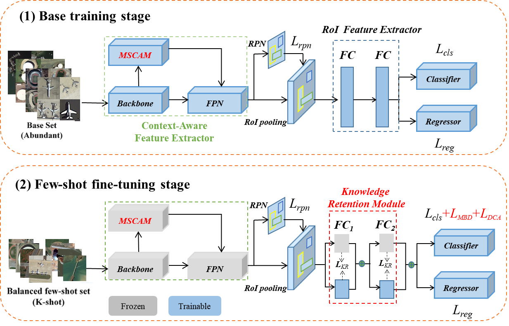

# CA-FSDet: Context-Aware Few-Shot Object Detection for Remote Sensing Images
This is the code for "CA-FSDet: Context-Aware Few-Shot Object Detection for Remote Sensing Images"



This code is based on [MMFewshot](https://github.com/open-mmlab/mmfewshot), you can see the mmfew for more detail about the instructions.


## Two-stage training framework


Following the original implementation, it consists of 3 steps:
- **Step1: Base training**
   - use all the images and annotations of base classes to train a base model.

- **Step2: Reshape the bbox head of base model**:
   - create a new bbox head for all classes fine-tuning (base classes + novel classes) using provided script.
   - the weights of base class in new bbox head directly use the original one as initialization.
   - the weights of novel class in new bbox head use random initialization.

- **Step3: Few shot fine-tuning**:
   - use the base model from step2 as model initialization and further fine tune the bbox head with few shot datasets.


### An example of DIOR split1 10-shot setting with single gpu

```bash
# step1: base training for dior split1
bash ./tools/detection/dist_train.sh \
    configs/detection/CA-FSDet/dior/split1/tfa_r101_mscam_fpn_dior-split1_base-training.py 1

# step2: reshape the bbox head of base model for few shot fine-tuning
python -m tools.detection.misc.initialize_bbox_head \
    --src1 work_dirs/tfa_r101_mscam_fpn_dior-split1_base-training/latest.pth \
    --method randinit \
    --save-dir work_dirs/tfa_r101_mscam_fpn_dior-split1_base-training
# step3(Model CA-FSDet): few shot fine-tuning
bash ./tools/detection/dist_train.sh \
    configs/detection/CA-FSDet/dior/split1/power4_0.01_weight_0.01_mu_tfa_r101_mscam_fpn_dior-split1_10shot-fine-tuning.py 1
```
**Note**:
- The default output path of the reshaped base model in step2 is set to `work_dirs/{BASE TRAINING CONFIG}/base_model_random_init_bbox_head.pth`.
  When the model is saved to different path, please update the argument `load_from` in step3 few shot fine-tune configs instead
  of using `resume_from`.
- To use pre-trained checkpoint, please set the `load_from` to the downloaded checkpoint path.

## Data preparation
We have provided  the few-shot annotations in 'data/few_shot_ann'. 
